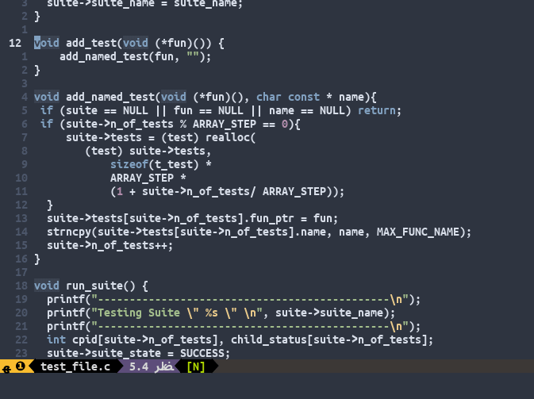

# vim-codepainter

A plugin for Vim to color different parts of code making the use of Highlights

This plugin is made to manage the different "colors" that you can assign to the code. The idea is as simple as to pre-append a delimeter like `#0#` before each line and then add a matching rule to highlight that lines.

## Demo

## How to use

Once installed (I highly recommend [vim-plug](https://github.com/junegunn/vim-plug)), you need to set a color (or use default), select the area you want to "paint" and press F2 (default key-binding) to paint it.

If you had something already painted, selecting and applying the same color will result on removing it (removing the tags and the match rule if there is no other marker for that color).

### Changing between colors

There are 10 colors definend on the plugin source, you can change them as you like. In order to change between them, you should run `:PainterPickColor <n>` where n is an integer from 0-9.

### Changing the delimiter

In case the default delimiter makes a conflict with your code, you can change it via the command `:PainterChangeDelimiter <arg>` , where arg should be a string and should have one character "d" which will represent the color.

So if I wanted to change the default delimiter to "\$\$d" I'll run `:PainterChangeDelimiter "$$d"`

### Cleaning everything

If you want to remove every marker and every match rule, you should run the command `:PainterEraseAll`

### Known issues

If you first paint something with a color and then apply another color to the same selection, it will result in an error. In this case, you should first unpaint the desired area with the paint color it already has and then apply the new color.
